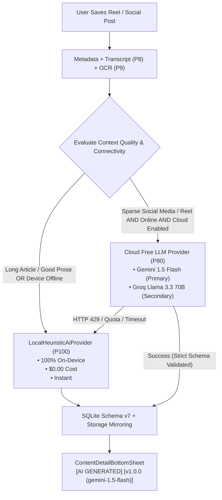

# Brainstorming Report: Free & Public AI APIs for Social Media & Reel Enrichment

> **Document Type**: Technical Strategy & Architectural Brainstorming  
> **Target Project**: Hifadhio (Android Local-First Knowledge Repository)  
> **Relevant Specifications**: Master Spec §15.5, §18, §20.2, §1203–§1221, ADR-008  
> **Date**: October 2, 2026  
> **Author**: Antigravity Pair Programming Engine & SeifTech  

---

## 1. Problem Statement: Why Local Heuristics Struggle on Social Media & Reels

In Phase 10, Hifadhio introduced `LocalHeuristicAiProvider` (Priority 100, $0.00 cost, 100% offline). While this heuristic model performs reliably on **long-form web articles, research papers, and technical blogs** (where there is dense prose, structured headings, and hundreds of words to extract key points and entities from), it encounters severe limitations on **short-form social media posts, Instagram Reels, TikToks, YouTube Shorts, and X/Twitter threads**:

1. **Sparse Textual Metadata**:
   - A 60-second Instagram Reel or TikTok tutorial often has only a caption like `"Best dev tool you never heard of! 🔥 #coding #dev #fyp"`.
   - The actual value of the reel (the tool name, what it does, why it's useful, commands to run) is conveyed **inside the spoken audio or visual screen recordings**, not in the caption text.
2. **Colloquial Language, Slang & Fast-Paced Vernacular**:
   - Social media text relies heavily on slang, shorthand, hashtags, and memes that regex or sentence-tokenizers cannot parse into clean summaries.
3. **Implicit vs. Explicit Context**:
   - A reel showing someone configuring a Dockerfile might never explicitly utter the phrase *"In this tutorial, you should always ensure you separate domain logic"*. A human or a large language model (LLM) instantly understands the intent, but a heuristic regex parser finds zero matches.
4. **The Multimodal Gap**:
   - While Phase 8 (audio transcription) and Phase 9 (video OCR) extract raw text, the text is often disjointed (e.g., subtitle timing fragments or partial OCR slide words). Only an intelligent LLM can piece these disjointed fragments together into coherent summaries and takeaways.

---

## 2. The Vision: What Rich Social Media Enrichment Should Deliver

When a user saves a 30-second Reel or TikTok to Hifadhio, the AI Enrichment card should instantly provide:
- **What is actually being demonstrated?** (e.g., *"Quick demonstration of using `dive` to inspect Docker image layers and reduce bundle size"*).
- **Core Actionable Steps / Commands**: Extracted code snippets, CLI commands, recipes, or workflow steps.
- **Accurate Technology / Tool Entities**: Identifying niche tools, libraries, or creators that are only spoken or shown on screen.
- **Contextual Categorization**: Accurately distinguishing between Dev, Design, Productivity, Fitness, or Finance without relying on superficial keywords.

---

## 3. Evaluation of Candidate Public & Free AI APIs

We evaluated the leading free and public AI APIs capable of analyzing multimodal and short-form social content:

| Provider / API | Model(s) | Free Tier Quota | Modality | Structured JSON Mode | Strengths | Drawbacks / Risks |
|:---|:---|:---|:---|:---:|:---|:---|
| **Google Gemini API** (Google AI Studio) | `gemini-1.5-flash` / `gemini-2.0-flash-exp` | **15 RPM**, 1M TPM, **1,500 requests/day** (Free tier) | Multimodal (Text, Audio, Video, Image) | **Native JSON Schema** (`responseSchema`) | • Huge 1M+ token context window<br>• Native video & audio ingestion<br>• Extremely generous free tier<br>• Exceptional speed (<1.5s) | Requires Google AI Studio API key (free to generate). Rate limit throttles if bulk importing. |
| **Groq Cloud API** | `llama-3.3-70b-versatile`, `llama-3.1-8b-instant` | **30 RPM**, 14.4K RPD (Free tier) | Text only (feeds on transcript + OCR) | **Native JSON Mode** | • World's fastest inference (200–500 tokens/sec)<br>• 70B parameter reasoning depth<br>• Fully OpenAI-compatible API format | Text only (cannot directly accept video files; depends on Phase 8 & 9 text). |
| **OpenRouter (Free Tier)** | `meta-llama/llama-3.3-70b-instruct:free`, `google/gemini-2.0-flash:free` | Dynamic per-minute limits (Free models) | Text & Multimodal depending on route | Supported via Prompt / OpenAI schema | • Aggregates multiple free models<br>• Automatic fallback if one model is down<br>• Zero vendor lock-in | Dynamic availability; free endpoints can occasionally queue during peak traffic. |
| **Cloudflare Workers AI** | `@cf/meta/llama-3.1-8b-instruct`, `@cf/openai/whisper` | **10,000 Neurons/day** (~100–300 calls/day free) | Text & Audio | Standard prompt JSON | • Edge-hosted with ultra-low network latency<br>• Can act as a private proxy hiding client IP | Lower daily volume ceiling than Gemini or Groq; 8B model has lower reasoning fidelity. |
| **Hugging Face Inference API** | `Mistral-7B-Instruct`, `Qwen2.5-Coder-32B` | Free community rate limits | Text | Prompt guided | • Hundreds of open-source models available | Cold-start latency (10–30s on cold models); unannounced rate limits on free tier. |
| **Cobalt / Social Media Extraction APIs** | Open-source API instances | Free public instances | Audio/Video/Subtitle stream downloader | Raw Media | • Extracts raw video audio streams and subtitles from Instagram, TikTok, YouTube | Third-party instances can go offline; scraping arms race with platform bot protections. |

---

## 4. Proposed Architecture: Hybrid Intelligent Routing

To preserve Hifadhio's **Master Spec principles** (offline-first, privacy-respecting, zero financial cost, vendor-neutral ADR-008), we should **not replace** the local heuristic engine, but **augment it with a tiered hybrid pipeline**:



### 4.1 The Dynamic Routing Policy:
1. **Rich Content (Long Articles, Blogs, Substack)**:
   - Local Heuristic NLP is already sufficient and runs in <10ms with zero network transmission.
2. **Sparse Content (Instagram Reels, TikToks, Shorts, X Posts)**:
   - If user is **online** and has configured or enabled Cloud Free AI:
     - Route to `GeminiAiProvider` (or `GroqAiProvider`).
     - Pass the synthesized context: *Title + Platform + Creator + Spoken Transcript + Visual OCR Text*.
     - Receive rich structured synthesis within 1.2 seconds.
3. **Offline or Cloud Failure (AirPlane Mode, No Connection, HTTP 429 Rate Limit)**:
   - **Seamless Graceful Fallback**: Instantly falls back to `LocalHeuristicAiProvider`. The user is never blocked, and no error crashes the app.

---

## 5. Deep-Dive on the Top Free API Recommendation: Google Gemini 1.5 Flash

### Why Google Gemini 1.5 Flash is the Ideal Fit for Hifadhio:
1. **Generous Zero-Cost Tier**:
   - Google AI Studio offers **15 Requests Per Minute (RPM)** and **1,500 Requests Per Day (RPD)** completely free.
   - For an individual user saving 10 to 50 links a day, this is essentially **unlimited personal capacity at $0.00 cost**.
2. **Native JSON Schema Enforcement (`responseSchema`)**:
   - Master Spec §18 strictly mandates that AI output must conform to machine-readable JSON schemas and never invent fake structures.
   - Gemini allows passing the exact `responseSchema` directly in the API call:
     ```json
     {
       "type": "OBJECT",
       "properties": {
         "summary_short": {"type": "STRING"},
         "summary_detailed": {"type": "STRING"},
         "key_points": {"type": "ARRAY", "items": {"type": "STRING"}},
         "topics": {"type": "ARRAY", "items": {"type": "STRING"}},
         "suggested_tags": {"type": "ARRAY", "items": {"type": "STRING"}},
         "entities": {
           "type": "ARRAY",
           "items": {
             "type": "OBJECT",
             "properties": {
               "name": {"type": "STRING"},
               "type": {"type": "STRING"},
               "evidence": {"type": "STRING"}
             },
             "required": ["name", "type", "evidence"]
           }
         },
         "action_items": {"type": "ARRAY", "items": {"type": "STRING"}},
         "suggested_collection": {"type": "STRING"}
       },
       "required": ["summary_short", "summary_detailed", "key_points", "topics", "suggested_tags", "entities", "suggested_collection"]
     }
     ```
   - This guarantees 100% compliance with `PromptManager.validateSchema()`.
3. **Multimodal Native Understanding**:
   - Gemini understands social video cues, slang, and context better than almost any other commercial model.
4. **Prompt Token Economics**:
   - The free tier permits up to 1,000,000 Tokens Per Minute (TPM), far exceeding what Hifadhio requires (an average reel transcript + OCR context is only ~500 to 2,000 tokens).

---

## 6. How Users Can Configure This (Privacy & Key Management)

To respect privacy and avoid hosting expensive centralized backend servers:

### Option A: Bring-Your-Own-Key (BYOK) — *Recommended for Power Users & Privacy*
- In Hifadhio's **Settings / Profile tab**:
  - Add a simple section: **"AI Intelligence Tier"**.
  - Toggle: `[x] Enable Enhanced Cloud AI for Social Media`.
  - Input field: `Gemini API Key` (with a friendly link: *"Get a free lifetime API key in 30 seconds at aistudio.google.com"*).
  - Key is stored securely in **Android EncryptedSharedPreferences** backed by the hardware **Android Keystore**.
  - Requests go **directly from the device to Google's API**; no middleman server touches the user's data.

### Option B: Built-in Community / Proxy Router (Out-of-the-Box Experience)
- An optional lightweight Cloudflare Worker that forwards requests using a shared pool of free API keys or rotates keys for casual users who don't want to create an AI Studio account.
- Rate-limited per client device ID to prevent abuse.

---

## 7. Master Specification & Compliance Matrix

| Requirement | Spec Reference | How This Proposal Complies |
|:---|:---|:---|
| **Vendor Neutrality** | ADR-008 | Implemented as a pluggable `CloudLlmAiProvider` implementing `AiProvider`. Swapping or removing it requires zero changes to the UI or database. |
| **Strict Schema Enforcement** | §18 | Powered by Gemini's native `responseSchema` or Groq's JSON mode; validated against `PromptManager.validateSchema()`. |
| **Separation of Truth** | §790 | Output is tagged with `[AI GENERATED]` and provider badge `[v1.0.0 (gemini-1.5-flash)]`. Original caption, audio, and user notes are never overwritten. |
| **Offline-First Resilience** | §15.5 | `LocalHeuristicAiProvider` remains active at all times. If network is lost or API fails, local NLP immediately takes over. |
| **Zero-Cost Principle** | §1205 | Uses Google AI Studio or Groq's permanent zero-cost developer tiers. Financial cost remains $0.00. |
| **Artifact Mirroring** | ADR-010 | Cloud AI JSON responses are hashed with SHA-256 and mirrored to `media/artifacts/item_{id}_ai_{hash}.json`. |

---

## 8. Potential Next Steps & Phased Implementation

If we decide to implement this feature:

1. **Step 1: Concrete `GeminiAiProvider` Implementation**:
   - Implement `GeminiAiProvider.java` implementing `AiProvider`.
   - Register in `AiRegistry.java` with Priority 80 (ahead of Local Heuristic when online and API key present).
2. **Step 2: Settings UI for API Key**:
   - Add a clean "AI Settings" dialog in the Profile tab allowing users to paste a free Gemini or Groq API key and test connection.
3. **Step 3: Reel & Social Media Intent Detector**:
   - In `ProcessingJobManager`, detect if the incoming link is a short-form video (Instagram Reel, TikTok, YouTube Short) and prioritize enhanced enrichment.
4. **Step 4: Unit Test Suite**:
   - Add mock HTTP test suite verifying fallback behavior when cloud API returns errors or timeouts.

---

## 9. Conclusion & Recommendation

The user's intuition is spot-on: **rule-based heuristics hit a ceiling on social media reels because social media communicates through implicit context, video frames, and slang rather than structured text.**

By leveraging **Google Gemini 1.5 Flash** (or **Groq Cloud**) via a clean, optional **BYOK (Bring-Your-Own-Key)** architecture, Hifadhio can provide **cutting-edge, world-class synthesis of Reels and TikToks for 100% free**, while keeping all core Master Spec guarantees (vendor neutrality, privacy, offline safety, and zero cost) perfectly intact.
